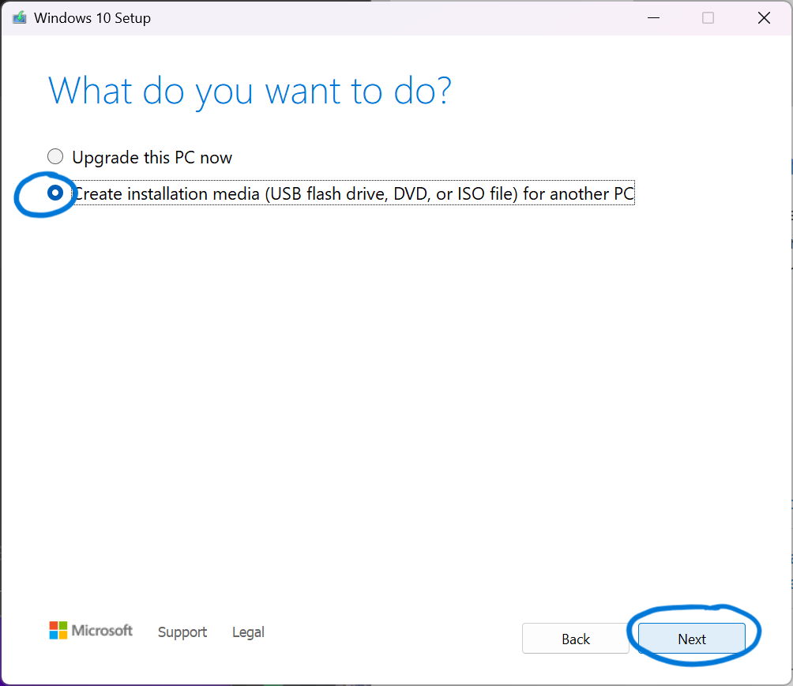
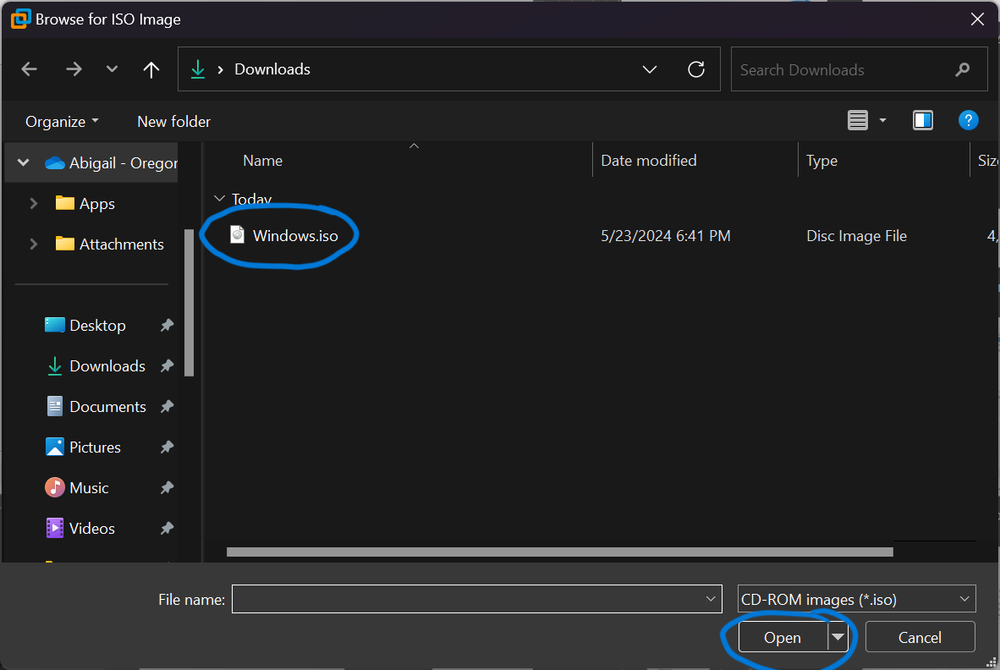
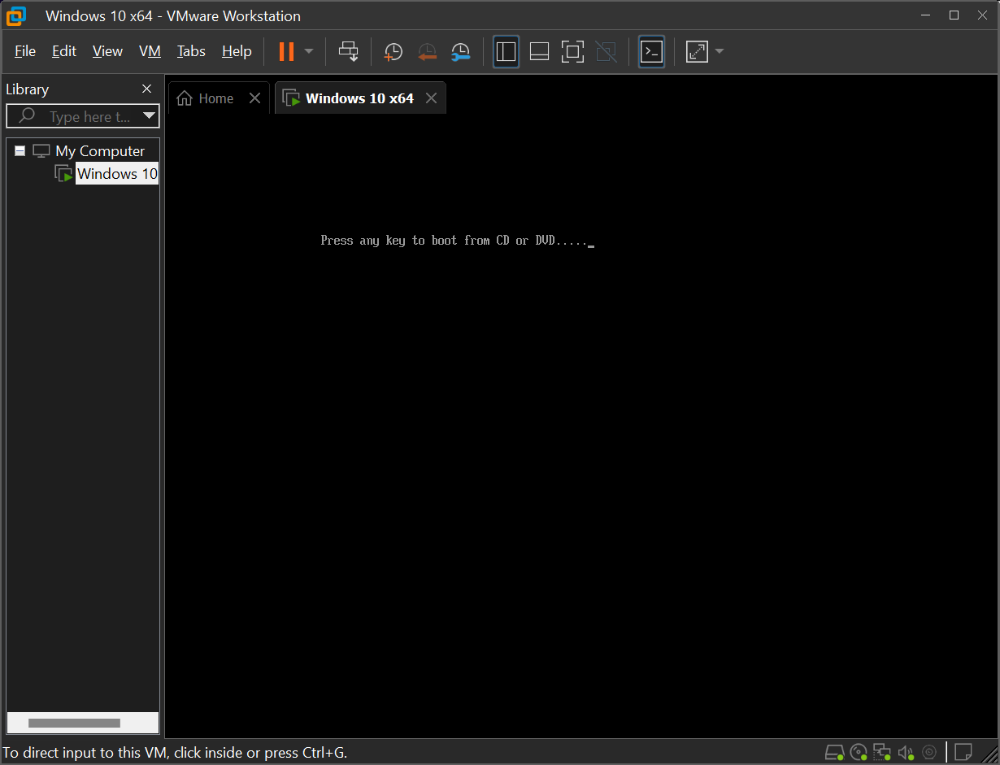
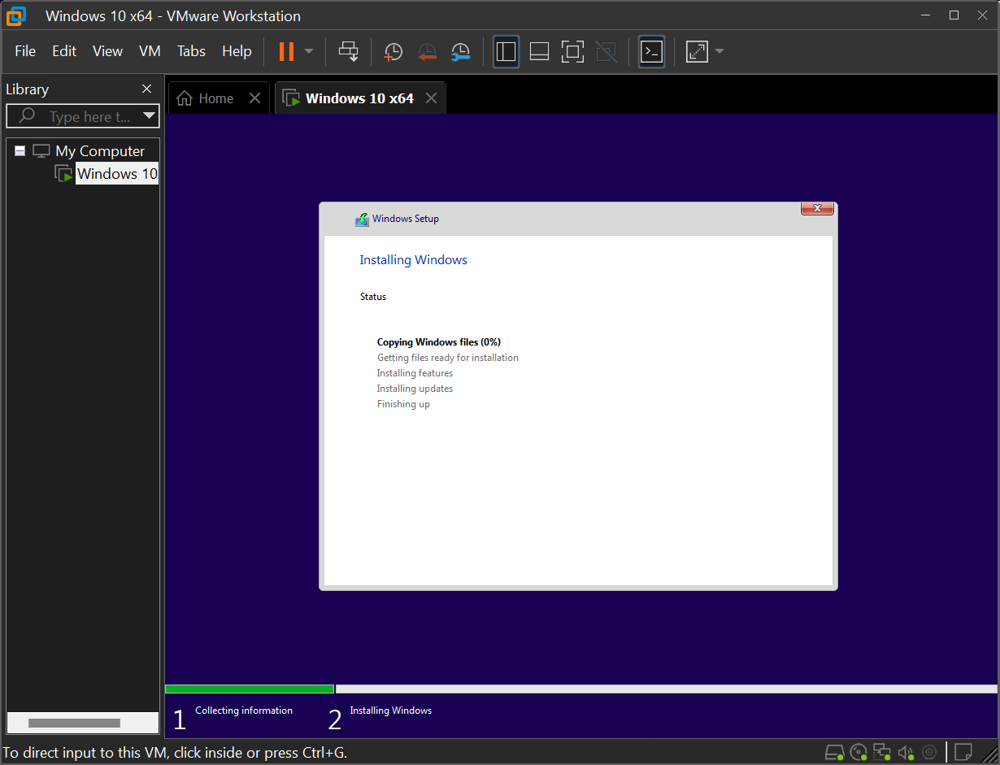
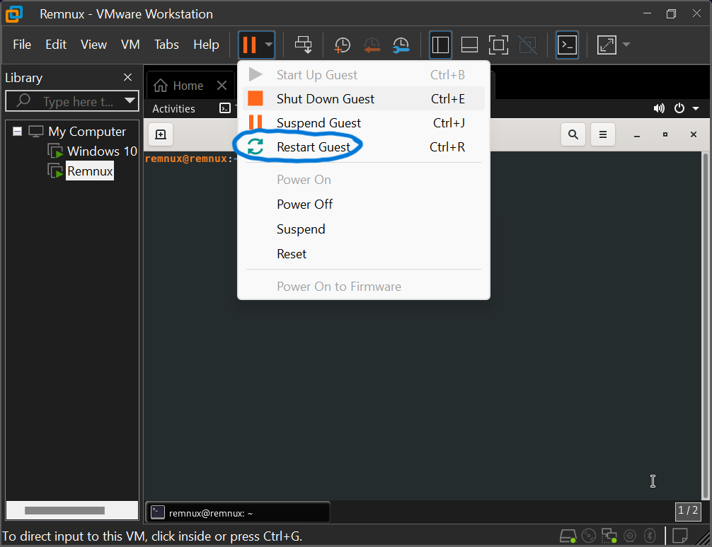
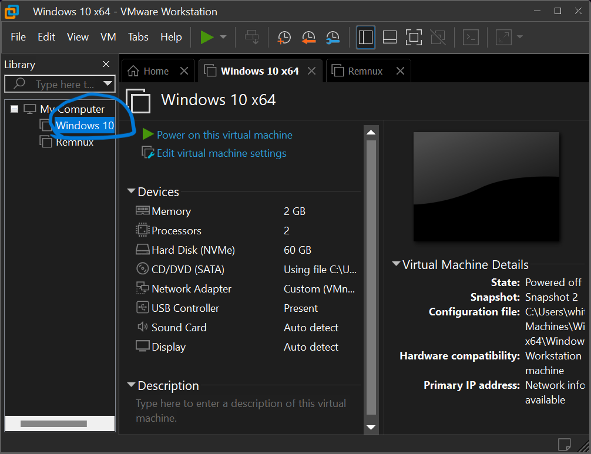

# Virtualization Environment Setup Tutorial

## Table of Contents
1. [About Virtualization](#About-Virtualization)
2. [Downloading VirtualBox](#Downloading-VirtualBox)
3. [Downloading VMware](#Downloading-VMware)
4. [Downloading the Windows ISO](#Downloading-the-Windows-ISO)
5. [Downloading the Remnux ISO](#Downloading-the-Remnux-ISO)
6. [Setting Up the VMs](#Setting-Up-the-VMs)
7. [VM Networking](#VM-Networking)
8. [References](#References)

## About Virtualization
**Why Use Virtualization?**
- Run multiple operating systems concurrently on a single physical machine.
- Simplify software installations and deployments.
- Facilitate testing environments and disaster recovery.
- Optimize and consolidate computing infrastructure.

**Key Terminology:**
- **Host OS**: The operating system of the physical computer.
- **Guest OS**: The operating system running inside the virtual machine.
- **Virtual Machine (VM)**: A software-based emulation of a physical computer.

**System Requirements**:
- **Memory**: At least 4GB RAM
- **Processor**: 2 CPU cores
- **Disk Space**: Minimum 160GB of free space (preferably  256GB)
    - 75GB for FlareVM
    - 60GB for REMnux

## Downloading VirtualBox
### For Windows Host OS
1. Visit [VirtualBox Downloads](https://download.virtualbox.org/virtualbox/7.0.16/VirtualBox-7.0.16-162802-Win.exe) to download the installer.
2. Run the downloaded executable and follow the on-screen instructions to install VirtualBox.

### For Linux Host OS (Ubuntu 22.04)
#### GUI Version
1. Visit [VirtualBox Downloads](https://download.virtualbox.org/virtualbox/7.0.18/virtualbox-7.0_7.0.18-162988~Ubuntu~jammy_amd64.deb) to download the installer.
2. Run the download executable and follow the on-screen instructions to install VirtualBox.

#### Command Line Version
1. Open the terminal.
2. Add VirtualBox repository by editing the source list:
   ```bash
   echo "deb [arch=amd64 signed-by=/usr/share/keyrings/oracle-virtualbox-2016.gpg] https://download.virtualbox.org/virtualbox/debian jammy contrib" | sudo tee -a /etc/apt/sources.list
   ```
3. Download and add the Oracle VirtualBox signing key:
    ```bash
    wget -q https://www.virtualbox.org/download/oracle_vbox_2016.asc -O- | sudo gpg --dearmor -o /usr/share/keyrings/oracle-virtualbox-2016.gpg
    ```
4. Update your package list and install VirtualBox:
    ```bash
    sudo apt-get update
    sudo apt-get install virtualbox-6.1
    ```

## Downloading VMWare
### Windows Host OS
### Linux Host OS

## Downloading the Windows ISO
1. Go to the [Windows Enterprise Landing Page](https://info.microsoft.com/ww-landing-windows-10-enterprise.html)
2. Enter in the required information under the "Register for your free trial today" section (first name, last name, email, company name, country/region, company size, job role, phone)
    - Note: It is recommended that you don't enter in your actual information as it is not verified by microsoft (including the phone number)
3. Click the download now button
4. Select the 64-bit edition under ISO
5. The download should start automatically

This link may work as well to [download the Windows ISO](https://go.microsoft.com/fwlink/p/?LinkID=2208844&clcid=0x409&culture=en-us&country=US)

## Downloading the REMnux OVA
### VirtualBox
1. Visit the [REMnux download documentition](https://docs.remnux.org/install-distro/get-virtual-appliance)
2. Under Step 1: Download the Virtual Appliance File click the "VirtualBox OVA" tab
3. Click the link to box
4. Press the download button

This link may work as well to [download the REMnux OVA for VirtualBox](https://app.box.com/s/8matvs5l0gc8vkr4xfq3szdm7mc9o0ad)

### VMWare
1. Visit the [REMnux download documentition](https://docs.remnux.org/install-distro/get-virtual-appliance)
2. Under Step 1: Download the Virtual Appliance File click the link for Box
3. Press the download button

This link may work as well to [download the REMnux OVA for VMWare](https://app.box.com/s/l8uo6loohghdatius2f7icuyp14q3wp6)

## Setting Up the VMs - VMWare

### Creating the Windows ISO
1. Accept the applicable notices and license terms

2. Select "Create installation media (USB flash drive, DVD, or ISO file) for another PC" and press next

3. If selected, unselect the "Use the recommended options for this PC" box. Ensure that the language is english, the edition is Windows 10, the architecture is 64-bit, and press next

4. Select "ISO file" and press next

5. Wait for the "Downloading Windows 10" page

6. Wait for the "Creating Windows 10 media" page

7. Press finish


### Installing Flare VM
1. In VMWare Workstation, select "Create a New Virtual Machine"

2. Ensure that "Typical (recommended)" is selected and press next

3. Select "Installer disc image file (iso):" and press "Browse..."

4. Find the ISO image you just created, select open, and then next

5. Press next

6. Ensure "Maximum disk size (GB):" is 60.0, "Split virtual disk into multiple files" is selected, and press next

7. Press finish

8. Upon the "Press any key to boot from CD or DVD..." screen, press a key to continue

9. Wait for bootup

10. On the "Windows Setup" page, ensure that "English" is selected for language to install and time and currency format, "US" is selected for keyboard or input method, and press next

11. On the "Activate Windows" screen, select "I don't have a product key", and press next

12. On the "Select the operating system you want to install" screen, select "Windows 10 Pro", and press next

13. On the "Applicable notices and license terms" screen, check "I accept the license terms", and press next

14. On the "Which type of installation do you want?" screen, select "Custom: Install Windows only (advanced)"

15. On the "Where do you want to install Windows?" screen, select "Drive 0 Unallocated Space", and press next

16. Wait for the installation

17. On the "Let's start with region. Is this right?" screen, select "United States", and press yes

18. On the "Is this the right keyboard layout?" screen, select "US", and press yes

19. On the "Want to add a second keyboard layout?" screen, press skip

20. Wait for some more installation

21. On the "How would you like to set up?" screen, select "Set up for personal use", and press next

22. On the "Let's add your account" screen, select "Offline account"

23. On the "Sign in to enjoy the full range of Microsoft apps and services" screen, select "Limited experience"

24. On the "Who's going to use this PC?" screen, type "Malware-Box" (or whatever you want your username to be), and press next

25. On the "Always have access to your recent browsing data" screen, press not now

26. On the "Choose privacy settings for your device" screen, unselect Location, Diagnostic data, Tailored experiences, Find my device, Inking & typing, and Advertising ID, and press accept

27. On the "Let's customize your experience" screen, press skip

28. On the "Let Cortana help you get things done" screen, press not now

29. Wait for final Windows installation

30. In the taskbar, search for "Proxy Settings", and open it

31. Under "Automatic proxy setup", unselect "Automatically detect settings", and close the window

32. In the taskbar, search for "Windows Security", and open it

33. Press "Virus & threat protection" and "Manage settings" under "Virus & threat protection settings"

34. On the "Virus & threat protection settings", unselect "Real-time protection" and "Cloud-delivered protection"

35. Also Unselect "Automatic sample submission" and "Tamper Protection", then close the window

36. 

37. In the taskbar, search for "Edit group policy"

38. 

39. In the Local Group Policy Editor, click on the "Administrative Templates" and the "Windows Components" folders

40. Scroll down until you find the "Microsoft Defender Antivirus" folder, click on it, and double click the "Turn off Microsoft Defender Antivirus" setting

41. Select enabled for the setting, then press apply and ok

42. Under the "Administrative Templates" folder, click on "Network", "Network Connections", and "Windows Defender Firewall" folders

43. Click the "Domain Profile" folder and double click the "Windows Defender Firewall: Protect all network connections" setting

44. Select disabled for the setting, then press apply and ok

45. Click the "Standard Profile" in the same path as before and double click the "Windows Defender Firewall: Protect all network connections" setting

46. Select disabled for the setting, then press apply and ok

47. Close the window, go back to the desktop, and select the "Take a snapshot of this virtual machine" button within VMware

48. Under the description, type "Pre-FlareVm", then press take snapshot

49. In the taskbar, search for "Powershell", and run it as an administrator

50. Type `cd C:\Users\Malware-Box\Desktop\`
- Note: The command will be different if your username is different

51. Type `(New-Object net.webclient).DownloadFile('https://raw.githubusercontent.com/mandiant/flare-vm/main/install.ps1',"$([Environment]::GetFolderPath("Desktop"))\\install.ps1")`

52. Ensure that install.ps1 appeared on your desktop and type `Unblock-File .\install.ps1`

53. Type `Set-ExecutionPolicy Unrestricted`

54. Type `Y` for the yes option

55. If there are no errors, the script will ask "Have you taken a VM snapshot to ensure you can revert to pre-installation state? (Y/N):". Type `Y`

56. Enter in the credentials you chose, if you did not enter a password, press enter

57. Wait for initial installation of flare vm

58. Once on the "FLARE VM Install Customization" screen, press ok

59. Wait for flare vm installation

60. If prompted for "Autologon Password", enter the password you chose, if you did not enter a password, press enter

61. Wait for this process to finish. It should take a while, but in the meantime, you can get started on the REMnux VM

### Setting Up REMnux
1. In VMware, click file and then open

2. Browse to where you install the remnux ova and press open

3. Type "Remnux" under "Name for the new virtual machine:" and press import

4. Wait for it to be imported

5. Click the green play button to power on the virtual machine

6. Wait for everything to load

7. Type `remnux upgrade` in the terminal that should have automatically opened

8. Wait for the upgrade to finish

9. Click edit and then "Virtual Network Editor" in VMware

10. Press "Change Settings" if applicable

11. Press the "Add Network..." button

12. Select an unused VMnet number under "Select a network to add" and press ok

13. Click on the new VMnet network you made, then select "Host-only", unselect "Connect a host virtual adapter to this network", take note of the subnet IP, and press ok

14. Click the dropdown next to the pause button and click "Restart Guest" in VMware

15. In the prompt, press shut down

16. Right click on the remnux machine you made in VMware

17. Press the settings option at the bottom

18. Click on "Network Adapter" and change the network connection to have "Custom" selected, then select the VMnet you created, and press ok

19. Press the green play button to power on the virtual machine again

20. Type `ip a` in the termnial and ensure that your ip address matches the VMnet subnet IP you took note of in step 13

21. Type `cd /etc/inetsim` and `sudo nano inetsim.conf`

22. In the file, uncomment the line "start_service dns"

23. Uncomment the line "service_bind_address" and put the address as "0.0.0.0"

24. Uncomment the line "dns_default_ip" and put the address as the static ip you want to use for remnux, then save and exit out of the file

25. Type `cd /etc/netplan/` and `sudo nano 01-netcfg.yaml`

26. Under the line "dhcp4", change it to "no" and add an "addresses: [ <ip address>/subnet ]" line under it. For the ip address, enter the static ip you want to use for remnux, then save and exit out of the file

27. Type `sudo reboot now` and wait for the reboot to finish


### Final Touches
1. Make sure everything was installed correctly by looking at log.txt, then exit out

2. In the bottom right, click the network icon and press "Network & Internet settings" option

3. Press the "properties" option under "Ethernet0"

4. Click "Ethernet 0" on the "Network Connections" page

5. Press "Properties" on the "Ethernet0 Status" page

6. Find the option labeled "Internet Protocol Version 4 (TCP/IPv4)" and press "Properties"

7. Under "Use the following IP address" option, type the IP address you want for FlareVM and "255.255.255.0" as the subnet mask. Then under "Use the following DNS server addresses" option, type the IP address you used for REMNux VM. Press ok to save the changes

8. Type ipconfig to make sure your changes was successful and that the IP address matches what you put in the last step. If it is not successful, make sure to follow steps 9 and 10

9. In VMware, right click the WIndows VM and select "Settings..."

10. Make sure that the virtual network is set to VMnet2 or whatever the network you setup for REMnux

11. To make sure the network is correctly set up, try pinging the IP address of REMnux. If it is unsuccessful look at the network settings or restart the VM

12. To make sure the network is correctly set up on the REMnux side, try pinging the IP address of FlareVM

13. In VMware, select the "Take a snapshot of this virtual machine" button on FlareVM

14. Enter in a relevant description for the snapshot and press "Take Snapshot"

15. In VMware, select the "Take a snapshot of this vritual machine" button on REMnux

16. Enter in a relevant description for the snapshot and press "Take Snapshot"

17. Shut down both VMs, select the Windows 10 machine/FlareVM, and press file in the top left

18. In the settings, press "Export to OVF..."

19. Save the file

20. Wait for the export

21. Then, select the REMnux VM and press file in the top left

22. In the file settings, press "Export to OVF..."

23. Save the file and wait for the export to finish


Note: Please note that while OVF is not the same as OVA, VMware has a tool to change OVFs to OVAs. Follow this tutorial to help figure out the process: https://www.vmwarearena.com/convert-ova-to-ovf-using-the-vmware-ovf-tool/

### Importing OVAs
1. In VMware, press file in the top left, and press "Open..."

2. Find the file, and select open. VMware should automatically start the import process


To view the exports we created, please refer to this link: https://oregonstate.box.com/s/b3npz71fuxbuhyhz8q9xfzq1d6zwvitm

## References
- https://www.sentinelone.com/labs/building-a-custom-malware-analysis-lab-environment/
- https://alexoloriz.com/building-a-malware-analysis-sandbox-a-step-by-step-guide/
